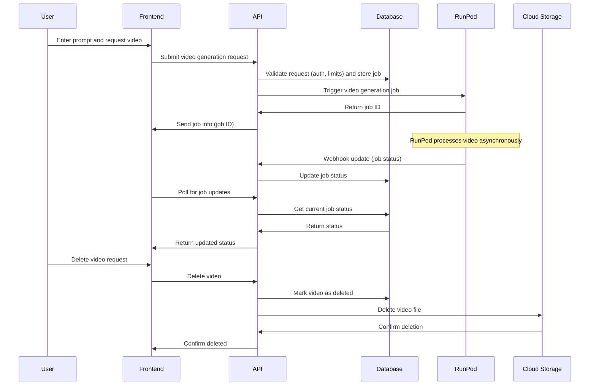

# Technical Flow

This document outlines the technical flow of video generation in OpenV.

## Video Generation Flow

The following diagram illustrates the interaction between different components of the system during
video generation and management:

### Components

- **Frontend (FE)**: Next.js application handling user interactions and video display
- **API**: Next.js API routes managing requests and RunPod integration
- **Database (DB)**: Supabase PostgreSQL database storing video metadata and job information
- **RunPod (RP)**: AI inference platform running the video generation model
- **Cloud Storage (CS)**: Storage service for generated videos

### Process Description

1. **Video Generation**

    - User enters a prompt and requests video generation
    - Frontend submits request to API
    - API validates and stores the job
    - RunPod processes the video asynchronously
    - Frontend polls for status updates

2. **Video Management**
    - Users can delete their videos
    - System cleans up both database records and stored files
    - All operations are authenticated and authorized
