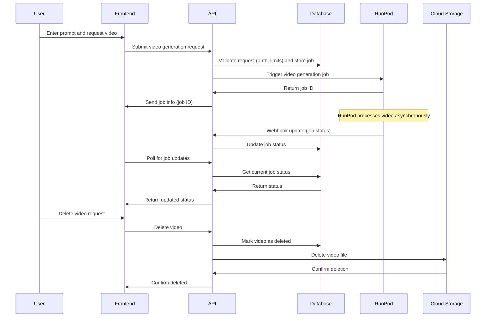

# Technical Flow

This document outlines the technical flow of video generation in OpenV.

## Video Generation Flow

The following diagram illustrates the interaction between different components of the system during
video generation and management:

### Components

- **Frontend (FE)**: Next.js application handling user interactions and video display
- **API**: Next.js API routes managing requests and RunPod integration
- **Database (DB)**: Supabase PostgreSQL database storing video metadata and job information
- **RunPod (RP)**: AI inference platform running the video generation model
- **Cloud Storage (CS)**: Storage service for generated videos

### Process Description

1. **Video Generation Request**

    - User enters a prompt and requests video generation
    - Frontend submits request to `/api/runpod` endpoint
    - Creates a new video record in the database with status "PENDING"
    - Sends request to RunPod API with the prompt and configuration
    - Returns job ID and status to frontend

2. **RunPod Processing**

    - RunPod processes the video generation asynchronously
    - Sends webhook updates to `/api/runpod/webhook` endpoint
    - Webhook payload includes job status and output URLs

3. **Status Updates**

    - Webhook endpoint receives status updates from RunPod
    - Updates video status in database (PENDING, PROCESSING, COMPLETED, FAILED)
    - Frontend polls the API for current status
    - Updates UI based on video status

4. **Video Management**
    - Users can view their generated videos
    - Delete functionality removes both database records and stored files

### Implementation Details

1. **API Endpoints**

    - `/api/runpod`: Handles video generation requests
    - `/api/runpod/webhook`: Processes RunPod status updates
    - `/api/videos`: Manages video metadata and user operations

2. **Database Schema**

    - Videos table tracks:
        - Generation status
        - User information
        - Prompt data
        - RunPod job ID
        - Output URLs
        - Creation and update timestamps

3. **Authentication**

    - Clerk handles user authentication
    - API routes are protected via middleware
    - User association maintained for all video operations

4. **Error Handling**

    - Failed generations are tracked in database
    - Users notified of failures

5. **Testing**
    - Unit tests for API endpoints
    - Integration tests for some endpoints
